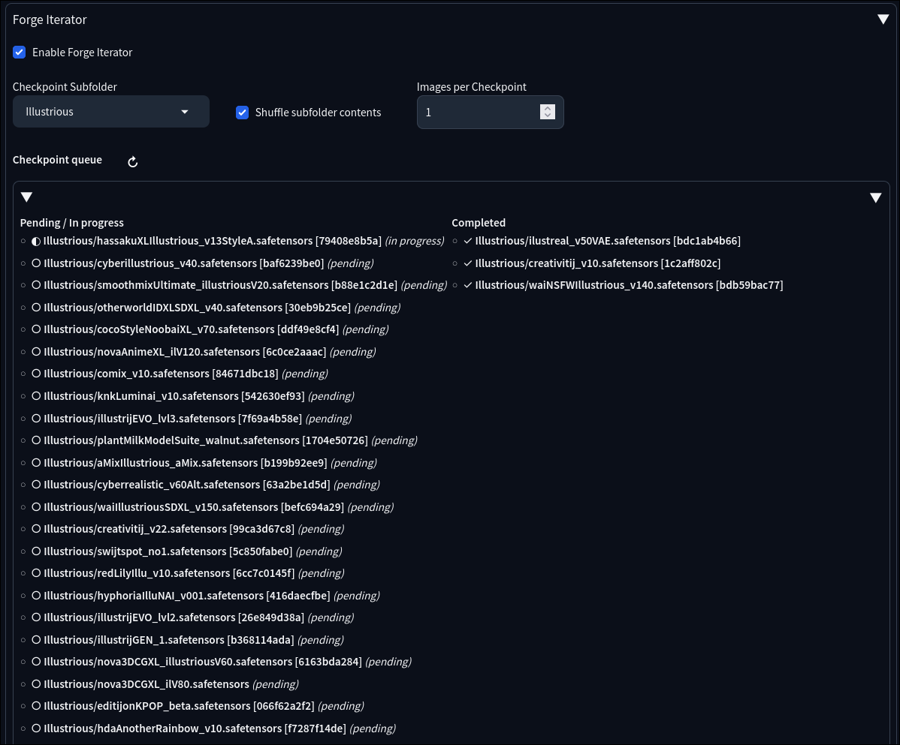

# Forge Iterator

An extension for Stable Diffusion WebUI (Forge/A1111) that allows you to cleanly iterate over a selected subfolder of checkpoints, generating a preset quantity of images per checkpoint, while perfectly preserving your prompt (including wildcards) and maintaining full compatibility with other Main scripts (like "One Button Prompt" or XYZ Plot).

## Features
- **AlwaysVisible Script**: Operates as an accordion under `txt2img` and `img2img` tabs.
- **Main Script Compatible**: Since it hooks into generation batches (`process_batch`) rather than taking over the entire `run` loop, it works flawlessly alongside your favorite Main scripts.
- **Dynamic Checkpoint Reloading**: Forces checkpoint swaps entirely on the fly during generation, ensuring tools relying on `alwayson_scripts` execute their states accurately.
- **Folder Filtering**: Automatically detects subdirectories in your `models/Stable-diffusion` path and organizes them into a drop-down. 
- **Images per Checkpoint**: Set how many images you want to generate for each checkpoint in the selected subfolder. Internally this multiplies your effective batch count based on how many checkpoints are found.
- **Checkpoint Queue View**: Shows a live, ordered list of all checkpoints queued for the current job, split into **Pending / In progress** and **Completed** columns, with a refresh button next to the "Checkpoint queue" heading.

## Installation
1. Navigate to your Stable Diffusion WebUI (Forge or Auto1111) `extensions/` directory.
2. `git clone https://github.com/kelsjon3/forge_iterator.git`
3. Restart or fully reload your WebUI.

## Usage
1. Open the *txt2img* or *img2img* tab.
2. Scroll to the "Forge Iterator" accordion at the bottom.
3. Check **Enable Forge Iterator**.
4. Select the **Checkpoint Subfolder** containing your desired models.
5. Set the **Images per Checkpoint**. 
   *(Note: This directly overrides the standard "Batch count" in the core UI based on the number of checkpoints found in the folder.)*
6. Optionally check **Shuffle subfolder contents** to randomize the order checkpoints are used.
7. Optionally expand **Checkpoint queue** to see the full queue; the left column shows **Pending / In progress**, the right column shows **Completed**. Use the ↻ button next to the heading to refresh.
8. Add your wildcards, select any other Main Script you want, and hit **Generate**.

## UI preview

## Note on Checkpoint Infotexts
This extension manually updates the `p.override_settings['sd_model_checkpoint']` metadata during each model swap, ensuring your final generated images correctly save the metadata for the *exact* model that generated them.